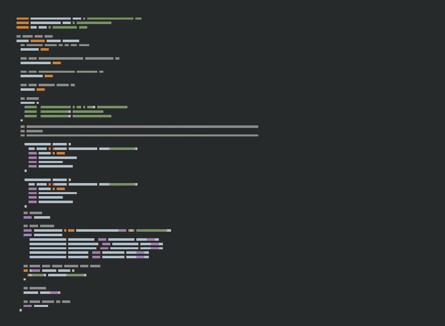

# Minimap Font

## Overview

Minimap is a font to use when you want to a 10,000ft view of text.

It was originally designed for grokking computer code, though you could use it as greek text in place of lorem ipsum.

Useful for screenshots, plugins, demos, mockups or such like:



## Usage

### Desktop

Install the .ttf file on your computer using your operating system's usual procedure.


### Web

Copy the stylesheet and web fonts to your web project, or use the following CSS snippet to load Minimap directly from a CDN:

```css
@font-face {
  font-family: 'minimap';
  src: url('https://cdn.rawgit.com/davestewart/minimap-font/ee2d6c79/src/webfont/minimap.woff2') format('woff2'),
  url('https://cdn.rawgit.com/davestewart/minimap-font/ee2d6c79/src/webfont/minimap.woff') format('woff');
  font-weight: normal;
  font-style: normal;
}

article {
  font-family: minimap, sans-serif;
}
```

#### Browser rendering

Note that a better visual result can be achieved by disabling anti-alisaing.
 
Support for this varies across browsers, but you can try adding the following rules for elements that show Minimap font:

```css
article {
  font-family: minimap, sans-serif;
  -webkit-font-smoothing: none;
  -moz-osx-font-smoothing: unset;
  font-smoothing: unset;
  filter: contrast(1);
}
```

See [this post](http://stackoverflow.com/questions/1752752/is-it-possible-to-disable-anti-aliasing-in-css-when-using-font-face-with-pixel) on Stack Overflow.

## License

Minimap is MIT licensed, so you can use it as you wish